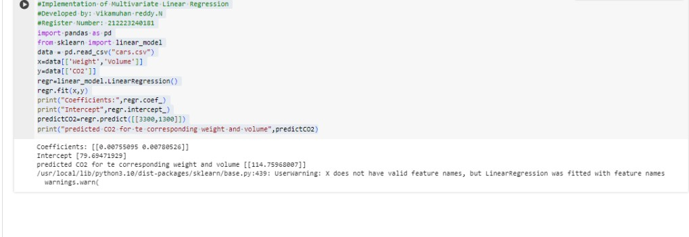

# Implementation of Multivariate Linear Regression
## Aim
To write a python program to implement multivariate linear regression and predict the output.
## Equipment’s required:
1.	Hardware – PCs
2.	Anaconda – Python 3.7 Installation / Moodle-Code Runner
## Algorithm:
### Step1
<br>
Import the pandas and scikit-learn libraries.

### Step2
<br>
Read the data from the csv file.

### Step3
<br>
Split the data into features (X) and target(y).

### Step4
<br>
Create and fit the linear linear regression model

### Step5
<br>
Print the coefficients and intercepts of the linear regression model.

### Step6
<br>
Make a prediction.

### Step7
<br>
Print the predicted CO2 emissions.

### Step8
<br>
End the Program.

## Program:
```py
#Implementation of Multivariate Linear Regression
#Developed by: Vikamuhan reddy.N
#Register Number: 212223240181
import pandas as pd
from sklearn import linear_model
data = pd.read_csv("cars.csv")
x=data[['Weight','Volume']]
y=data[['CO2']]
regr=linear_model.LinearRegression()
regr.fit(x,y)
print("Coefficients:",regr.coef_)
print("Intercept",regr.intercept_)
predictCO2=regr.predict([[3300,1300]])
print("predicted CO2 for te corresponding weight and volume",predictCO2)

```
## Output:


### Insert your output

<br>

## Result
Thus the multivariate linear regression is implemented and predicted the output using python program.